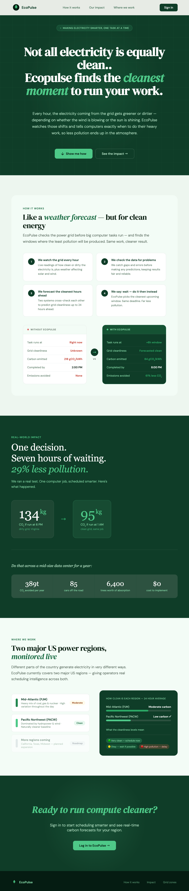
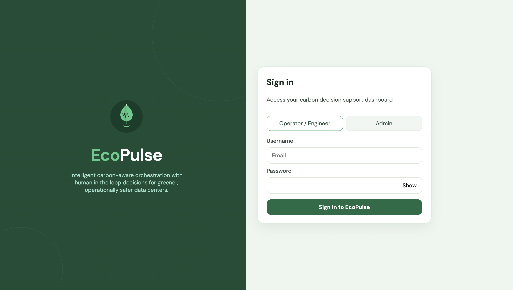
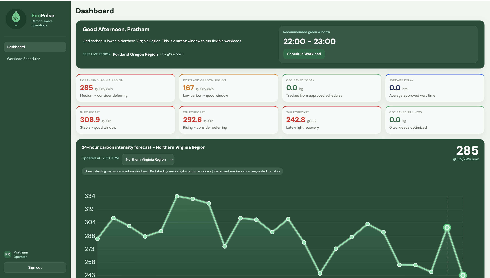
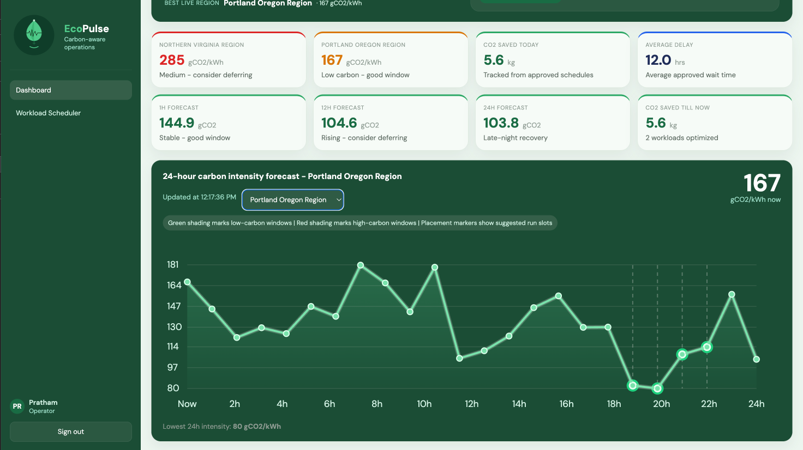
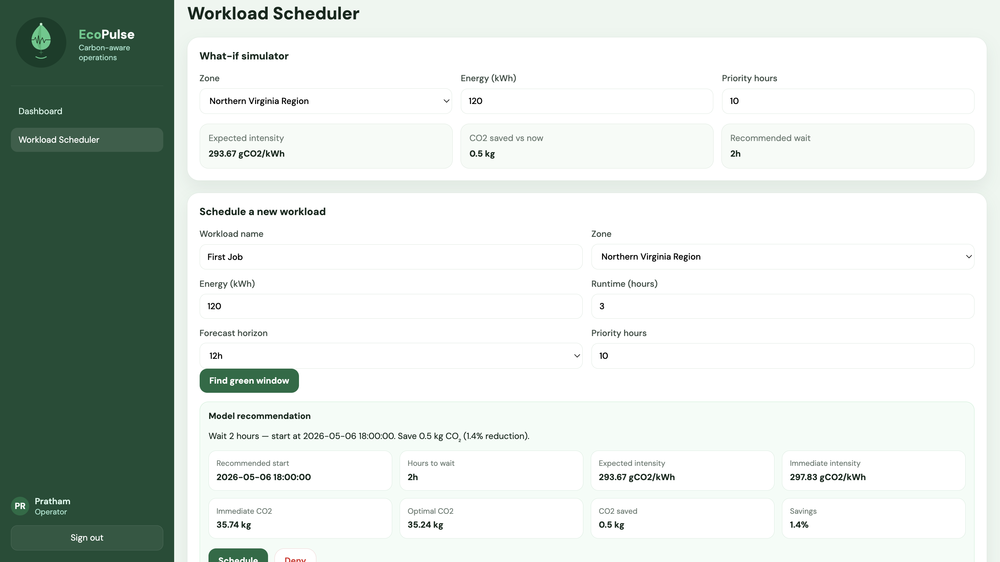
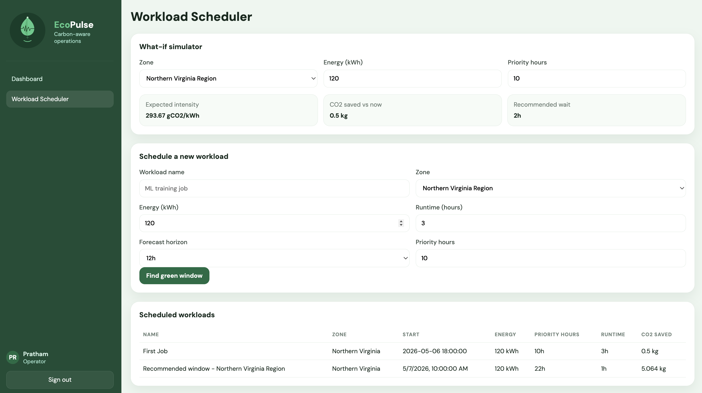
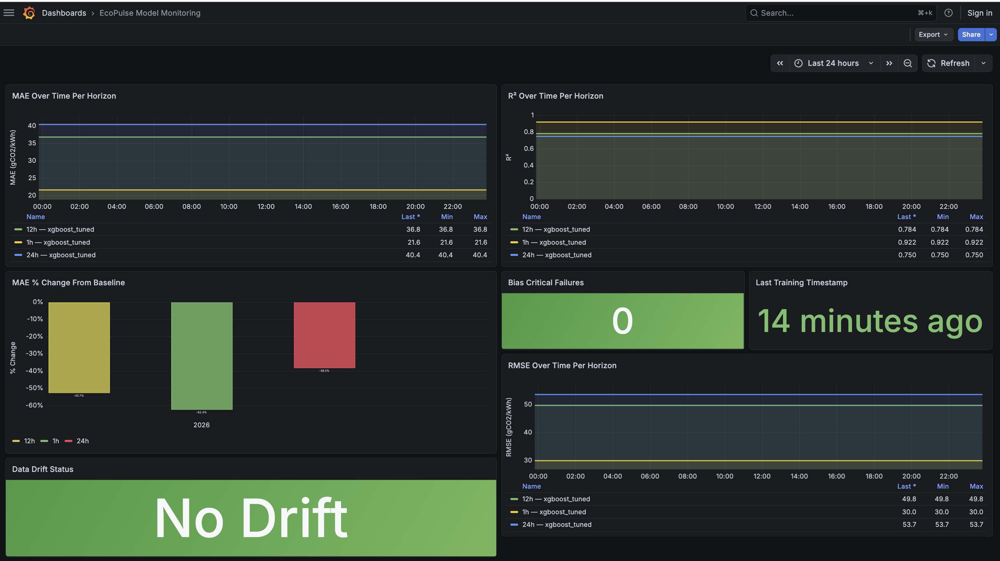
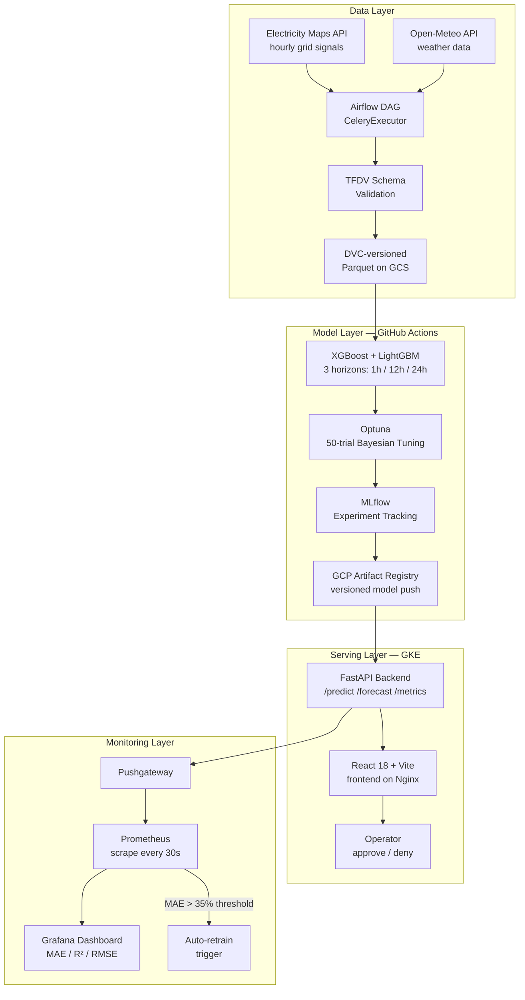

# EcoPulse

<div align="center">

**Carbon-Aware Workload Scheduling Platform for Data Centers**

[](https://python.org)
[](https://cloud.google.com)
[](https://kubernetes.io)
[](https://docker.com)
[](https://xgboost.ai)
[](LICENSE)

*Forecast grid carbon intensity. Schedule smarter. Cut emissions 20–40% — no hardware changes required.*

</div>

---

## The Problem

Data centers run 24/7 and consume a staggering share of global electricity — much of it generated from fossil fuels. The vast majority of compute workloads (batch jobs, model training runs, backups, data processing) are **time-flexible**: they have a deadline, but they don't need to start *right now*.

Yet today, these jobs fire whenever it's convenient, with zero consideration for whether the grid is running on wind and solar or on coal and gas.

**EcoPulse fixes that.** It forecasts carbon intensity up to 24 hours ahead and shows operators exactly which window in their scheduling horizon has the lowest emissions footprint. Same deadline. Less carbon. No infrastructure changes.

---

## Live Demo

| Service | URL |
|---------|-----|
| Frontend Dashboard | `https://ecopulse.prathammehtaa.com` |
| Grafana Monitoring | `https://grafana.ecopulse.prathammehtaa.com` |

> Login credentials — **Username:** any email &nbsp;|&nbsp; **Password:** `ecopulse` &nbsp;|&nbsp; **Admin:** select Admin role, same password

---

## Screenshots

<table>
  <tr>
    <td align="center" width="50%">
      
      <br/><sub><b>Landing Page</b> — project overview, how it works, and impact stats</sub>
    </td>
    <td align="center" width="50%">
      
      <br/><sub><b>Login Page</b> — role-based access (Operator / Admin)</sub>
    </td>
  </tr>
  <tr>
    <td align="center" width="50%">
      
      <br/><sub><b>Dashboard (View 1)</b> — live carbon intensity, 24h forecast chart, green window recommendation</sub>
    </td>
    <td align="center" width="50%">
      
      <br/><sub><b>Dashboard (View 2)</b> — multi-region comparison and forecast cards</sub>
    </td>
  </tr>
  <tr>
    <td align="center" width="50%">
      
      <br/><sub><b>Workload Scheduler</b> — submit a job, get a CO₂-optimal start time</sub>
    </td>
    <td align="center" width="50%">
      
      <br/><sub><b>Scheduler History</b> — approve, deny, and track scheduled workloads</sub>
    </td>
  </tr>
  <tr>
    <td align="center" colspan="2">
      
      <br/><sub><b>Grafana Monitoring</b> — real-time MAE / R² / RMSE trends, auto-retrain alerts</sub>
    </td>
  </tr>
</table>

---

## Key Results

Models trained on **240,435 rows**, **91 features**, **6 years of data (2019–2025)** across two US grid zones.

| Horizon | Model | R² | MAE (gCO₂/kWh) | RMSE | vs. Baseline |
|---------|-------|-----|----------------|------|-------------|
| **1 hour** | XGBoost | **0.922** | **21.6** | 30.1 | **+62.4% R²** |
| **12 hours** | XGBoost | **0.784** | **36.8** | 48.5 | **+51.8% R²** |
| **24 hours** | XGBoost | **0.750** | **40.4** | 52.3 | **+41.3% R²** |

**Additional achievements:**
- Bias (critical failure count) reduced from **11 → 1** using temporal sample weighting
- Hyperparameters tuned with Optuna Bayesian search — **50 trials per horizon**
- Pipeline end-to-end: **8 parallel CI/CD jobs**, ~1 hour wall-clock time

---

## Architecture



---

## Tech Stack

**ML & Data Science**


**MLOps**


**Infrastructure & Cloud**


**Backend & Frontend**


**Monitoring**


---

## Project Structure

```text
EcoPulse/
├── api/                          # FastAPI backend — all endpoints
│   └── main.py                   # /predict, /forecast, /regions, /metrics, /shap, /drift
│
├── Data_Pipeline/                # Ingestion, preprocessing, validation
│   ├── dags/                     # Airflow DAGs (hourly_ingestion, backfill_ingestion)
│   ├── src/                      # Grid + weather ingestion, merge, TFDV schema, bias mitigation
│   ├── data/processed/           # DVC-tracked Parquet files (GCS remote)
│   └── pipeline_config/          # YAML configs
│
├── Model_Pipeline/               # Training, tuning, validation, inference
│   ├── src/
│   │   ├── train_xgboost.py      # XGBoost training (3 horizons)
│   │   ├── hyperparameter_tuning.py  # Optuna 50-trial Bayesian search
│   │   ├── model_validation.py   # R², MAE, RMSE, bias checks
│   │   ├── bias_detection.py     # Disparate performance across zones/time
│   │   ├── drift_detection.py    # Feature and prediction drift
│   │   └── inference/
│   │       ├── predict.py        # CarbonPredictor
│   │       ├── feature_builder.py
│   │       └── green_window.py   # WorkloadScheduler, GreenWindowDetector
│   └── models/                   # Trained .ubj model artifacts
│
├── frontend/                     # React 18 + Vite + Nginx
│   └── src/pages/                # LandingPage, Dashboard, Scheduler, Admin, Alerts
│
├── IaC/                          # Terraform — GKE, GCS, IAM, networking
├── k8s/                          # Kubernetes manifests (Deployments, Services, Ingress)
├── monitoring/                   # Prometheus config, Grafana dashboards, alert rules
│
├── .github/workflows/
│   ├── model_training.yml        # Train + push models to Artifact Registry
│   ├── deploy-backend.yml        # Build + deploy FastAPI to GKE
│   ├── deploy-frontend.yml       # Build + deploy React to GKE
│   ├── deploy-infra.yml          # Terraform apply
│   └── tests.yml                 # Unit + integration tests
│
└── docker-compose.yaml           # Full local stack (API, frontend, Airflow, Postgres, Redis)
```

---

## MLOps Pipeline

EcoPulse ships with **5 GitHub Actions workflows** and up to **8 parallel jobs** running in CI, covering the full path from data to production.

```
Push to main
    │
    ├── tests.yml ──────────────────────────── Unit + integration tests
    │
    ├── model_training.yml
    │   ├── [parallel] pull-data (DVC + GCS)
    │   ├── [parallel] train-1h  ──── XGBoost + Optuna → MLflow → GCS
    │   ├── [parallel] train-12h ──── XGBoost + Optuna → MLflow → GCS
    │   ├── [parallel] train-24h ──── XGBoost + Optuna → MLflow → GCS
    │   └── push-registry ─────────── Tag + push to GCP Artifact Registry
    │
    ├── deploy-backend.yml ─────────── Docker build → GKE rolling deploy
    ├── deploy-frontend.yml ────────── Docker build → GKE rolling deploy
    └── deploy-infra.yml ───────────── Terraform plan + apply
```

**Auto-retraining:** Prometheus watches MAE per horizon. If MAE degrades beyond 35% of the training baseline, an alert fires and triggers a `workflow_dispatch` on `model_training.yml` — no human intervention needed.

---

## Model Monitoring

EcoPulse runs a full observability stack alongside the API:

- **Prometheus** scrapes a custom metrics exporter every 30 seconds — tracking MAE, RMSE, R², prediction latency, and request volume per horizon and grid zone
- **Pushgateway** collects batch metrics from model evaluation jobs
- **Grafana** visualizes all metrics in real time with pre-built panels for each forecast horizon
- **Alert rules** notify via Slack and trigger automatic retraining when performance degrades

The Grafana dashboard screenshot above shows the full monitoring setup in production.

---

## Getting Started

### Prerequisites

- Python 3.11+, Node.js 20+, Docker Desktop

### 1. Clone

```bash
git clone https://github.com/Prathammehtaa/EcoPulse.git
cd EcoPulse
```

### 2. Environment variables

Create a `.env` file in the project root:

```env
AIRFLOW_UID=50000
GCP_PROJECT_ID=your-gcp-project-id
GCS_BUCKET=ecopulse
GOOGLE_APPLICATION_CREDENTIALS=/opt/airflow/config/gcp-service-account.json
ELECTRICITY_MAPS_API_KEY=your_key
OPEN_METEO_BASE_URL=https://archive-api.open-meteo.com/v1/archive
SLACK_WEBHOOK_URL=your_slack_webhook
SMTP_HOST=smtp.gmail.com
SMTP_PORT=587
SMTP_USER=your_email@gmail.com
SMTP_PASSWORD=your_app_password
```

### 3. Run the full stack with Docker Compose

```bash
docker compose up -d
```

This starts: FastAPI backend, React frontend (Nginx), Airflow (webserver + scheduler + worker), Postgres, Redis.

| Service | URL |
|---------|-----|
| React frontend | http://localhost:3000 |
| FastAPI + Swagger | http://localhost:8000/docs |
| Airflow UI | http://localhost:8080 |

### 4. Run without Docker (dev mode)

```bash
# Backend
pip install -r requirements.txt
uvicorn api.main:app --reload --port 8000

# Frontend (separate terminal)
cd frontend && npm install && npm run dev
# → http://localhost:5173
```

### 5. Trigger data ingestion

In the Airflow UI at `http://localhost:8080`, enable and trigger the `hourly_ingestion` DAG.

---

## Deployment to GKE

### Prerequisites

- `gcloud` CLI authenticated, `kubectl` configured, Terraform installed

### 1. Provision infrastructure

```bash
cd IaC
terraform init
terraform apply
```

This creates the GKE cluster, GCS bucket, Artifact Registry, IAM service accounts, and Secret Manager entries.

### 2. Deploy all services

```bash
# Push your branch — GitHub Actions handles the rest
git push origin main
```

The `deploy-backend.yml`, `deploy-frontend.yml`, and `deploy-infra.yml` workflows run automatically. Monitor progress in the **Actions** tab.

### 3. Apply Kubernetes manifests manually (optional)

```bash
kubectl apply -f k8s/
```

---

## API Reference

| Method | Endpoint | Description |
|--------|----------|-------------|
| GET | `/health` | Model load status |
| GET | `/regions` | Live carbon intensity for all zones |
| GET | `/forecast/{zone}` | 24-hour carbon intensity forecast |
| POST | `/predict` | WorkloadScheduler — optimal start time + CO₂ savings |
| GET | `/metrics` | Model performance metrics (MAE, R², RMSE) |
| GET | `/drift` | Feature and prediction drift report |
| GET | `/shap` | SHAP feature importance |
| GET | `/alerts` | System alerts |
| POST | `/retrain` | Trigger model retraining |

**Example — schedule a workload:**

```bash
curl -X POST http://localhost:8000/predict \
  -H "Content-Type: application/json" \
  -d '{
    "zone": "US-MIDA-PJM",
    "energy_kwh": 120,
    "runtime_hours": 4,
    "horizon": 12,
    "priority_hours": 6
  }'
```

```json
{
  "recommended_start": "2026-04-14 06:00:00",
  "hours_to_wait": 2,
  "expected_intensity_gco2_kwh": 359.2,
  "immediate_intensity_gco2_kwh": 377.15,
  "co2_saved_kg": 2.154,
  "co2_savings_pct": 4.8,
  "recommendation": "Wait 2 hours — start at 06:00. Save 2.2 kg CO₂ (4.8% reduction)."
}
```

---

## Grid Zones

| Zone | Region | Grid Characteristics |
|------|--------|---------------------|
| `US-MIDA-PJM` | Northern Virginia | Mid-Atlantic — heavy coal/gas mix, higher baseline intensity |
| `US-NW-PACW` | Portland, Oregon | Pacific Northwest — dominated by hydropower, lower baseline intensity |

---

## Acknowledgements

- **Professor Ramin Mohammadi** — for guidance throughout the project and for pushing us to build something production-grade
- **Google** — EcoPulse was presented at the Google campus office expo, where it received recognition from Google engineers
- **2nd Place** — at the Northeastern University MLOps course final project showcase

---

## License

MIT License — see [LICENSE](LICENSE) for details.

---

<div align="center">

Built with purpose. Deployed on GKE. Monitored 24/7.

**[Live Demo](https://ecopulse.prathammehtaa.com) · [Grafana](https://grafana.ecopulse.prathammehtaa.com) · [GitHub](https://github.com/Prathammehtaa/EcoPulse)**

</div>
